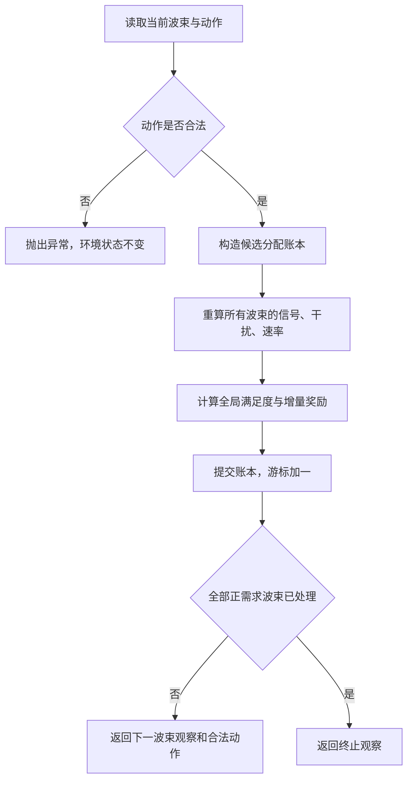

# Horizon 与 Spectrum：状态空间、动作空间及环境实例推导

日期：2026-09-21  
对应实现：`horizon_tsac_20260920` 与 `spectrum_tsac_20260921`  
阅读目标：用一个完整回合说明“模型看到什么、能选择什么、环境怎样计算后果”。

## 1. 两版的范围与关系

**Horizon 与 Spectrum 当前使用相同的环境规则，区别主要在模型如何编码观察。** 本次逐文件核对发现，两版 `env/` 下的 `environment.py`、`action.py`、`physics.py`、`reward.py`、`metrics.py`、`state.py` 六个文件内容完全相同；默认数据、物理与环境配置也相同。下文的同一场景、同一动作序列已分别运行两版环境，奖励、终止标记和最终速率一致。

这不表示它们与重构前的 `sac_fyh_io` 环境等价。本文解释的是**现在的计算模型**，其中每束总功率均分到频槽、全账本重算干扰、奖励为全局满足度增量；这些规则与重构前存在实质差异。

本例使用合成输入和人为指定动作，旨在让公式可以手算。没有运行神经网络、训练或测试集选参，不把示例最终分数当成算法成绩。

## 2. 一个场景就是一个分配回合

### 2.1 环境的任务

一个场景包含若干波束及其业务需求。环境按既定服务顺序，每一步处理一个正需求波束，为它选择连续频槽和总功率，或者选择跳过。

已经处理的波束不会再次获得动作机会，但后续波束的干扰可能降低它的速率。因此，“完成该波束的动作”不等于“它的最终速率已经固定”。

把内部状态写成：

$$
s_t=(\mathcal C,\mathcal L_t,c_t;\Theta),
$$

其中：

- $\mathcal C$：本回合固定场景，包括波束位置、需求、宽度、增益、温度、资源组、极化和服务顺序。
- $\mathcal L_t$：已经执行的分配账本，记录每个已处理波束是 ALLOC 还是 SKIP，以及起点、长度、总功率。
- $c_t$：当前服务顺序的游标。
- $\Theta$：环境与物理配置。

占用矩阵、剩余功率、干扰、速率和满足度都可以由上述数据重新计算。固定场景和动作之后，环境转移是确定性的；策略采样、训练数据增强等随机性不等于环境在 `step()` 内随机改变物理后果。

### 2.2 保持正式环境的资源参数

本例只减少波束数，没有把频谱资源缩成另一套玩具配置。

| 参数 | 本例取值 | 含义 |
|---|---:|---|
| 频槽数 $M$ | 100 | 槽索引为 0–99 |
| 每槽带宽 $B$ | 25 MHz | 连续两槽对应 50 MHz |
| 频率起点 | 17.7 GHz | 槽中心还需加半个槽宽 |
| 资源组数 $G$ | 8 | 组索引为 0–7 |
| 总功率预算 $P_{\max}$ | 6000 W | 全场景共享 |
| 单束功率档位 | 5、10、…、50 W | 指整束总功率 |
| 连续长度上限 $L_{\max}$ | 10 槽 | 还须满足边界和占用约束 |
| 发射／接收峰值增益 | 50／40 dBi | 本例各真实实体相同 |
| 噪声温度 | 290 K | 每槽噪声为 $k_BTB$ |
| SINR 裕量 | 5 dB | 代码统一作用于噪声与干扰之和 |
| 奖励缩放 | 100 | 奖励为 $100\Delta U$ |

**8 个资源组共享同一条 100 槽物理频率轴，并非 800 个互不干扰的频率。** 同组不允许重叠；跨组可以复用同一频槽，但同极化之间仍会产生干扰。当前实现要求：

$$
\operatorname{pol}_i=g_i\bmod 2.
$$

即组 0、2、4、6 为一种极化，组 1、3、5、7 为另一种；两种极化按理想隔离处理。

### 2.3 本例的六行输入

为使路径损耗和天线增益容易复核，所有真实实体都放在纬度 $0^\circ$、经度 $122.2^\circ$，即设定的星下点。真实实体地面覆盖角直径均为 $2^\circ$。同位置是用于展示强干扰的教学构造，不代表实际覆盖数据的分布。

| 名称 | beam_id | 进入环境的需求 | group_id | 极化 | entity_mask | demand_mask | 初始含义 |
|---|---:|---:|---:|---:|---|---|---|
| A | 10 | 600 Mbps | 0 | 0 | True | True | 待分配 |
| B | 20 | 500 Mbps | 2 | 0 | True | True | 待分配 |
| C | 30 | 400 Mbps | 1 | 1 | True | True | 待分配 |
| D | 40 | 300 Mbps | 0 | 0 | True | True | 待分配 |
| E | 50 | 0 | 3 | 1 | True | False | 真实零需求实体 |
| F | 60 | 0 | 0 | 0 | False | False | padding，宽度为 0 |

本例通过 `coverage.v2` 标准输入显式提供分组，服务顺序为：

$$
\operatorname{service\_order}=[10,20,30,40].
$$

因此数组行数为 6，真实实体数为 5，正需求数 $N_D=4$，总需求为 1800 Mbps。E 不参加动作决策和满足度分母，但仍是真实实体；F 不参加实体注意力和满足度分母。

这里的需求已经是输入环境的最终需求，标准输入不会再乘 0.25。若换成旧格式 CSV，在默认 `traffic_scale=0.25` 下，要得到相同需求，原始 `rate` 应为 2400、2000、1600、1200 Mbps。

旧格式 CSV 未提供分组时，加载器按原始正需求排名取模 8 生成分组；本例为了同时展示跨组干扰和同组冲突，显式采用了表中的分组，不能把这个分组声称为默认 CSV 自动分组结果。

## 3. 状态空间：内部状态、环境观察与网络输入

### 3.1 “205 维”不是完整状态空间的大小

环境内部状态 $s_t$ 包含整场景和完整账本。`observe()` 返回一个观察字典，其中同时包含完整观察和局部 `legacy205` 向量。

“205”只表示局部观察向量的维度；状态取值包含连续实数、离散状态、掩码和可变实体轴，不是只有 205 种状态。神经网络编码后的 128 维隐藏向量，也不是环境的原始状态空间。

### 3.2 完整观察的主要字段

下表的 $N$ 指输入数组行数，本例 $N=6$；批处理还可能沿实体轴补齐长度。

| 字段 | 默认／本例形状 | 内容 |
|---|---|---|
| `beam_static` | $N\times8$，本例 $6\times8$ | 各实体位置、需求、宽度、增益、温度、斜距 |
| `beam_dynamic` | $N\times5$，本例 $6\times5$ | 当前速率、满足度、起点、长度、总功率 |
| `group_id`、`order_rank`、`status` | 各 $N$ | 资源组、服务顺序排名、处理状态 |
| `entity_mask`、`demand_mask` | 各 $N$ | 真实实体与正需求标记 |
| `pending_mask`、`allocated_mask`、`skipped_mask` | 各 $N$ | 当前处理阶段 |
| `allocation_start/length/power_w` | 各 $N$ | 可重建账本的分配字段 |
| `occupancy` | $8\times100$ | 每组每槽是否占用 |
| `current_slot_features` | $100\times4$ | 当前波束对应的逐槽特征 |
| `global_features` | 25 | 资源、需求、进度和配置特征 |
| `legacy205` | 205 | 当前波束的局部观察 |
| `valid_action_mask` | 9551 | 当前合法动作标记 |
| `current_beam_index`、`current_group` | 标量 | 当前实体行索引与资源组 |
| `remaining_power_w`、`terminal` | 标量 | 剩余功率与终止标记 |

此外还返回稳定 `beam_id`、观察版本和动作字典签名，用于身份与接口核验。字典里存在某字段，不表示每一种网络都会直接把它作为数值输入。

### 3.3 每束静态和动态特征的准确公式

以纬度 $\varphi_i$、经度 $\lambda_i$、需求 $D_i$（bps）、地面角直径 $w_i$（度）、斜距 $d_i$（km）表示：

$$
x_i^{\rm static}=\left[
\frac{\varphi_i}{90},\frac{\lambda_i}{180},
\ln\left(1+\frac{D_i}{10^8}\right),w_i,
\frac{G_{i,\rm tx}^{\rm dBi}}{50},
\frac{G_{i,\rm rx}^{\rm dBi}}{50},
\frac{T_i}{290},\frac{d_i}{42164}
\right].
$$

注意：增益特征这里是 **dBi 数值除以 50**，不是线性增益相除；宽度直接使用角直径数值，没有除以 2 或裁剪到 $[0,1]$。

动态特征为：

$$
x_{i,t}^{\rm dynamic}=\left[
\ln\left(1+\frac{R_{i,t}}{10^8}\right),u_{i,t},
\frac{a_{i,t}^{\rm start}}{100},\frac{\ell_{i,t}}{10},\frac{P_{i,t}}{50}
\right].
$$

本例 A 初始静态特征约为：

```text
[0, 0.6788889, 1.9459101, 2, 1, 0.8, 1, 0.8488995]
```

初始动态特征为 `[0, 0, -0.01, 0, 0]`。未分配时 `start=-1`，所以除以 100 后为 `-0.01`，不能把它误当成已经分配到槽 0。

状态编号固定为：`IDLE=0`、`PENDING=1`、`ALLOCATED=2`、`SKIPPED=3`。初始六行状态为 `[1,1,1,1,0,0]`，终局为 `[2,2,2,3,0,0]`；E 与 F 的区别依靠 `entity_mask`，不能仅看 `status=0`。

### 3.4 当前频槽的四个特征

当前波束记为 $i$，当前组为 $g_i$。每槽特征为：

$$
x_{s,t}^{\rm slot}=\left[
\frac{s}{99},\ O_{g_i,s},\
\ln\left(1+\frac{I_{i,s}}{N_{i,s}}\right),\
\ln\left(1+\frac{N_{i,s}}{10^{-13}}\right)
\right].
$$

$O_{g_i,s}$ 是**当前组**的占用，$I_{i,s}$ 却来自所有同极化、同频槽的已分配波束。因此可以出现“占用为 0、干扰很大”的槽，这正是后文 B 面对的状态。

本例初始槽 0 特征约为 `[0, 0, 0, 0.6936323]`，最后一项不是 0，因为噪声存在。

### 3.5 全局 25 维特征

以下索引从 0 开始。设正需求集合为 $\mathcal D$，待处理集合为 $\mathcal P_t$。

| 索引 | 内容／公式 |
|---|---|
| 0 | 总预算 $P_{\max}/6000$ |
| 1 | 剩余功率 $P_{\rm remain}/6000$ |
| 2 | 正需求数 $N_D/200$ |
| 3 | 处理进度 $c_t/\max(N_D,1)$ |
| 4 | 待处理数量 $\lvert\mathcal P_t\rvert/200$ |
| 5 | $\ln(1+\sum_{i\in\mathcal P_t}D_i/10^8)$ |
| 6 | $\ln(1+\sum_{i\in\mathcal P_t}D_i/[\max(\lvert\mathcal P_t\rvert,1)10^8])$ |
| 7 | $\ln(1+\sum_iD_i/10^8)$ |
| 8 | 槽数 $M/100$ |
| 9 | 最大功率档位 $P_{\rm level,max}/50$ |
| 10 | 槽宽 $B/(25\times10^6)$ |
| 11 | 起始频率 $f_{\rm start}/10^{10}$ |
| 12 | SINR 裕量 dB 值除以 10 |
| 13 | 卫星轨道半径 km 值除以 42164 |
| 14 | 地球半径 km 值除以 6371 |
| 15、16 | 卫星经度除以 180、纬度除以 90 |
| 17–24 | 各组空闲槽比例 $\frac1{100}\sum_s(1-O_{g,s})$ |

维度来自 $17+8=25$。这些分母是代码的缩放常数，不代表观察数值必定落在 $[0,1]$；例如需求的对数特征、宽度都可以大于 1。

### 3.6 局部 205 维怎样形成

$$
o_t^{205}=\left[
\underbrace{\varphi_i/90,\lambda_i/180,D_i/10^9,w_i,P_{\rm remain}/6000}_{5\text{项}},
\underbrace{\ln(1+I_{i,s}/N_{i,s})\big|_{s=0}^{99}}_{100\text{项}},
\underbrace{O_{g_i,s}\big|_{s=0}^{99}}_{100\text{项}}
\right].
$$

这里需求采用线性 $D_i/10^9$，与完整静态特征里的对数缩放不同。完整环境始终保存全场景，局部网络只是使用它的一部分观察。

本例三个关键时刻如下，`0×98` 表示连续 98 个零。

```text
初始，轮到 A：
前5项 = [0, 0.6788889, 0.6, 2, 1]
干扰块 = [0×100]
占用块 = [0×100]

A 分配后，轮到 B：
前5项 = [0, 0.6788889, 0.5, 2, 0.9916667]
干扰块 = [5.8711562, 5.8683434, 0×98]
占用块 = [0×100]                 # B 所在组2仍空闲

A、B、C 分配后，轮到 D：
前5项 = [0, 0.6788889, 0.3, 2, 0.9783333]
干扰块 = [6.5628924, 6.5600758, 0×98]
占用块 = [1, 1, 0×98]           # D 与 A 同属组0
```

局部向量看不到其他波束各自的需求、满足度和完整分配账本，不能把它称为完整马尔可夫状态。

## 4. Horizon 与 Spectrum 如何使用同一份观察

### 4.1 Horizon 完整观察模型

`full_attention` 路径使用全场景波束特征、当前槽特征和全局特征。每束先拼接：

$$
8\text{维静态}+5\text{维动态}
+[\operatorname{order\_rank}/\max(N_E,1),\operatorname{demand\_mask},\operatorname{entity\_mask}]
=16\text{个数值},
$$

其中 $N_E$ 是真实实体数，本例为 5，**不是正需求数 4，也不是模板行数 6**。网络再加入 group/status 嵌入，经波束与频槽编码、上下文读取后产生隐藏向量。padding 被掩码排除，真实零需求实体仍可参加实体编码。

七基线中的 MLP/CNN-SAC、MLP-DQN、MLP-PPO，以及局部 T-SAC 控制组，只使用上述局部 205 维和合法动作掩码；它们不因此获得 Horizon 完整信息。

### 4.2 Spectrum 残差模型

当前默认 `cnn_attention_residual` 使用两条路径：

1. **局部 CNN 路径**：读取 205 维中的两条 100 槽序列和前 5 个属性。
2. **完整场景上下文路径**：读取全部实体静态／动态特征、顺序、掩码、group/status 和全局特征。

其编码输出形式为：

$$
z=z_{\rm CNN}+\alpha\,m\,\tanh(v_{\rm context}),
\qquad
m=\max\left(1,\sqrt{\frac1d\sum_{j=1}^d\operatorname{stopgrad}(z_{{\rm CNN},j})^2}\right),
$$

默认 $\alpha=0.25$，$d=128$。上下文出口零初始化时残差为零；这是编码器初始化机制，不会改变环境的状态转移或动作合法性。Spectrum 的 CNN 对照组若配置为 `cnn_local`，只读局部输入。

Spectrum 残差路径不直接读取 `current_slot_features` 的四通道张量，频谱局部信息来自 `legacy205` 的 CNN 路径。Horizon 完整注意力路径会直接读取该四通道张量。二者**共用环境观察定义，实际编码路径不同**。

## 5. 动作空间：9551 个候选怎样推出来

### 5.1 动作不能自由选择波束或资源组

当前波束由 `service_order[cursor]` 决定，组号由场景中的 `group_id` 决定。策略只能为这个波束选择：

$$
a_t=\operatorname{SKIP}
\quad\text{或}\quad
a_t=\operatorname{ALLOC}(u,\ell,k),
$$

其中：

- $u\in\{0,\ldots,99\}$：连续频谱起点。
- $\ell\in\{1,\ldots,10\}$：槽数，且 $u+\ell\le100$。
- $k\in\{0,\ldots,9\}$：功率索引，对应 $P_k=5(k+1)$ W。

SKIP 的结构为 `kind="SKIP", start=-1, length=0, power_index=-1`。它不消耗资源，却会处理掉当前波束并推进游标；该波束不会在后续步骤再被分配。

### 5.2 固定候选字典大小

长度为 $\ell$ 的连续区间有 $100-\ell+1$ 个起点，每个区间有 10 档功率。因此：

$$
|\mathcal A|=1+10\sum_{\ell=1}^{10}(100-\ell+1)
=1+10(100+99+\cdots+91)
=\boxed{9551}.
$$

不能直接写成 $100\times10\times10+1$，因为右边界处的一些长度组合无效。9551 是固定候选数，**每一步真正合法的候选数可能更少**。

ID 0 为 SKIP；ALLOC 按起点、长度、功率索引依次排序：

$$
\operatorname{ID}(u,\ell,k)
=1+10\sum_{v=0}^{u-1}\min(10,100-v)+10(\ell-1)+k.
$$

本例 `ALLOC(0,2,9)` 的 ID 为 20，总功率 50 W；`ALLOC(0,2,5)` 的 ID 为 16，总功率 30 W。同一个 ID 20 在 A 和 B 的步骤作用于不同波束和资源组。

### 5.3 合法动作掩码

非终止状态下，SKIP 总是合法。ALLOC 还必须同时满足：

$$
u+\ell\le100,\qquad
\sum_{s=u}^{u+\ell-1}O_{g_i,s}=0,\qquad
P_k\le P_{\rm remain}+\varepsilon,
$$

默认预算容差 $\varepsilon=10^{-8}$ W。边界约束已在候选字典构建时落实，占用和剩余功率则逐状态计算。

干扰高不会让一个动作自动变成非法；同组冲突和预算不足才会被上述 mask 排除。因此合法动作完全可能得到负奖励。

若剩余功率加容差仍不足最小档 5 W，即 $P_{\rm remain}+\varepsilon<5$ W，或者没有任何可用区间，非终止状态仍保留 SKIP。到终止状态时 mask 全为 False，此时不能再调用策略或 `step()`。

## 6. 环境怎样从动作算出速率

### 6.1 总功率先分配到每个槽

对已分配波束 $j$：

$$
p_{j,s}=\begin{cases}
P_j/\ell_j,&s\in\{u_j,\ldots,u_j+\ell_j-1\},\\
0,&\text{其他槽，或该束未分配。}
\end{cases}
$$

因此 $\sum_s p_{j,s}=P_j$。例如 50 W、2 槽对应每槽 25 W，总预算只扣 50 W。不能把 50 W 同时用在两个槽，又只扣一次预算。

### 6.2 几何、链路增益与逐槽频率

设地面实体位置向量为 $\boldsymbol x_i$、卫星位置为 $\boldsymbol x_{\rm sat}$：

$$
d_i=\|\boldsymbol x_i-\boldsymbol x_{\rm sat}\|,
\qquad
\theta_{ji}=\arccos\frac{(\boldsymbol x_j-\boldsymbol x_{\rm sat})\cdot(\boldsymbol x_i-\boldsymbol x_{\rm sat})}{d_jd_i}.
$$

本例实体位于星下点，所以：

$$
d=(42164-6371)\times1000=35\,793\,000\ \mathrm m,
\qquad\theta_{ji}=0.
$$

槽中心频率为：

$$
f_s=17.7\times10^9+(s+0.5)\times25\times10^6\ \mathrm{Hz}.
$$

故 $f_0=17.7125$ GHz，$f_1=17.7375$ GHz。单位发射功率产生的接收增益为：

$$
h_{ji,s}=G_{j,\rm tx}(\theta_{ji})\,G_{i,\rm rx}
\left(\frac{c}{4\pi d_i f_s}\right)^2.
$$

$j$ 是发射波束，$i$ 是接收／受害实体；接收增益和传播距离取接收端 $i$。本例所有夹角为零，发射增益取峰值，线性增益乘积为 $10^{50/10}10^{40/10}=10^9$，因此：

$$
h_0=1.4160081417071332\times10^{-12},\qquad
h_1=1.4120193883593269\times10^{-12}.
$$

这些数值用于信号和两个方向的干扰计算，不另造一套干扰功率语义。

### 6.3 噪声、干扰、SINR 和 Shannon 速率

$$
N_{i,s}=k_BT_iB,
\qquad
I_{i,s}=\sum_{\substack{j\ne i\\\operatorname{pol}_j=\operatorname{pol}_i}}p_{j,s}h_{ji,s},
\qquad
S_{i,s}=p_{i,s}h_{ii,s}.
$$

本例 $k_B=1.380649\times10^{-23}$，故：

$$
N=1.380649\times10^{-23}\times290\times25\times10^6
=1.000970525\times10^{-13}\ \mathrm W.
$$

令 $\Gamma=10^{5/10}=3.1622776601683795$，程序计算：

$$
\operatorname{SINR}_{i,s}=\frac{S_{i,s}}{\Gamma(N_{i,s}+I_{i,s})},
\qquad
R_i=\sum_{s=0}^{99}B\log_2(1+\operatorname{SINR}_{i,s}).
$$

SINR 代入对数时使用线性值，不能把 dB 数值直接代入。若用 dB 表示，上式相当于对原始 $S/(N+I)$ 的 dB 值减 5；已经使用 $\Gamma$ 后不能再减一次。

当前实现对所有已分配波束重新计算这些量，不递推旧的 dB SINR。异极化理想隔离是此模型的假设；高干扰会降低速率，但不存在单独的“低于某个SINR就必须拒绝该动作”的硬门槛。

## 7. 满足度与奖励的推导

对正需求波束：

$$
u_{i,t}=\min\left(\frac{R_{i,t}}{D_i},1\right),
\qquad
U_t=\frac1{N_D}\sum_{i\in\mathcal D}u_{i,t}.
$$

本例分母始终为 4。pending 或 SKIP 波束的速率为零，所以满足度为零；不会因为尚未处理就从分母里删除。真实零需求实体和 padding 不进入分母，也不给满足度加 1。

每一步奖励为：

$$
r_t=100(U_{t+1}-U_t).
$$

对当前波束 $i_t$，可以分解为：

$$
\Delta U_t=
\underbrace{\frac{u_{i_t,t+1}-u_{i_t,t}}{N_D}}_{\text{当前束收益}}
-\underbrace{\frac{\sum_{j\ne i_t}(u_{j,t}-u_{j,t+1})}{N_D}}_{\text{历史束效用损失}}.
$$

因此有用的新分配也可能带来负奖励：新增波束的收益不一定抵得过对已有波束的伤害。奖励没有额外叠加 SGM、占用或功率罚项；预算和同组占用由硬约束控制，干扰损失通过 $\Delta U$ 体现。

从全未分配的 $U_0=0$ 开始：

$$
\sum_{t=0}^{T-1}r_t=100(U_T-U_0)=100U_T.
$$

这是未折扣奖励的望远镜求和恒等式。当前配置 $\gamma=1$ 时，它也对应终局满足度目标；若未来改成 $\gamma<1$，折扣回报不再简单等于 $100U_T$。

## 8. 按真实代码走完四步

人为动作序列为：

```text
A → ALLOC(start=0, length=2, power_index=9)  # 总功率50 W，ID 20
B → ALLOC(start=0, length=2, power_index=9)  # 总功率50 W，ID 20
C → ALLOC(start=0, length=2, power_index=5)  # 总功率30 W，ID 16
D → SKIP                                  # ID 0
```

B 的重叠分配和 D 的主动跳过都是为展示机制而选择，不代表最优策略。

### 8.1 第一步：A 占用组 0 的槽 0、1

A 的每槽发射功率为 $50/2=25$ W，当前无干扰：

$$
\operatorname{SINR}_{A,0}=\frac{25h_0}{\Gamma N}=111.83673248,
\quad
\operatorname{SINR}_{A,1}=111.52169959.
$$

$$
R_A=25\times10^6[\log_2(1+111.83673248)+\log_2(1+111.52169959)]
=340.80381057\ \mathrm{Mbps}.
$$

$$
u_A=340.80381057/600=0.5680063510,
\quad U_1=u_A/4=0.1420015877,
\quad r_0=14.2001587739.
$$

功率剩余 5950 W，组 0 的前两槽被占用。下一步轮到 B，B 在组 2，其占用行仍全空，但前两槽已经受到 A 的同极化干扰。

### 8.2 第二步：B 在组 2 复用槽 0、1

该动作合法，因为 B 与 A 不同组，且预算充足；但两束同极化、同位置、同频槽，各自每槽 25 W，因此互相干扰：

$$
\operatorname{SINR}_{A,s}=\operatorname{SINR}_{B,s}
=\frac{25h_s}{\Gamma(N+25h_s)}.
$$

两槽 SINR 约为 0.3153361266、0.3153336150，即约 −5.0123 dB。于是：

$$
R_A=R_B=19.77150708\ \mathrm{Mbps}.
$$

注意，A 的速率必须从 340.80 Mbps **重新算成** 19.77 Mbps，而不是保持原值：

$$
U_2=\frac14\left(\frac{19.77150708}{600}+\frac{19.77150708}{500}\right)
=0.0181238815.
$$

$$
r_1=100(0.0181238815-0.1420015877)
=\boxed{-12.3877706246}.
$$

B 的当前效用贡献为 0.0098857535，A 的历史效用损失为 0.1337634598，后者明显更大。**合法、分配成功、零硬约束违约，都不保证这个动作有正收益。**

### 8.3 第三步：C 在组 1 复用槽 0、1

C 与 A/B 异极化，在当前模型下隔离。C 总功率 30 W，即每槽 15 W：

$$
\operatorname{SINR}_{C,s}=\frac{15h_s}{\Gamma N}.
$$

两槽分别为 67.10203949、66.91301975，得到：

$$
R_C=304.38105943\ \mathrm{Mbps},
\qquad u_C=304.38105943/400=0.7609526486.
$$

A/B 速率不变，因此：

$$
U_3=U_2+u_C/4=0.2083620436,
\qquad r_2=19.0238162142.
$$

当前用了 130 W，剩余 5870 W。前三组局部占用可画为：

```text
频槽索引       0    1    2    3   …   99
组0／极化0     A    A    .    .   …    .
组1／极化1     C    C    .    .   …    .
组2／极化0     B    B    .    .   …    .
组3–7          .    .    .    .   …    .
```

### 8.4 第四步：D 的非法动作检查与主动 SKIP

D 与 A 同组 0，所以 `ALLOC(0,2,9)` 会与 A 冲突。代码实际验证：此动作抛出 `ValueError`，且账本、游标与环境状态不变，不会自动截短。

D 仍可以使用槽 2–99，形成 98 个连续空闲槽。其合法分配数量为：

$$
10\sum_{\ell=1}^{10}(98-\ell+1)=10(98+97+\cdots+89)=9350.
$$

加上 SKIP，合法动作数为 **9351**。所以示例里的 SKIP 是主动选择，`forced_skip=False`，并非环境强迫。

执行 SKIP 后，D 速率为 0，不增加占用或功率，奖励 $r_3=0$。游标从 3 变成 4，等于 $N_D$，环境返回 `terminated=True`、`truncated=False`。

### 8.5 整个回合的实测结果

速率单位均为 Mbps；“下一状态合法动作数”包括非终止时的 SKIP。

| 时刻 | 当前动作 | A 速率 | B 速率 | C 速率 | D 速率 | 全局 $U$ | 本步奖励 | 剩余功率 W | 下一状态合法动作数 |
|---|---|---:|---:|---:|---:|---:|---:|---:|---:|
| 初始 | — | 0 | 0 | 0 | 0 | 0 | — | 6000 | 9551 |
| 第一步后 | A：50 W／2槽 | 340.803811 | 0 | 0 | 0 | 0.142001588 | 14.200158774 | 5950 | 9551 |
| 第二步后 | B：50 W／2槽 | 19.771507 | 19.771507 | 0 | 0 | 0.018123881 | −12.387770625 | 5900 | 9551 |
| 第三步后 | C：30 W／2槽 | 19.771507 | 19.771507 | 304.381059 | 0 | 0.208362044 | 19.023816214 | 5870 | 9351 |
| 第四步后 | D：SKIP | 19.771507 | 19.771507 | 304.381059 | 0 | 0.208362044 | 0 | 5870 | 0 |

奖励之和为 $20.8362043635=100U_T$。最终分配比例为 $3/4=75\%$，跳过比例为 $1/4=25\%$，完全满足比例为 0。三个已分配波束均未达到自己的需求。

最终池占用率为 $6/(8\times100)=0.75\%$，物理频率覆盖率为 $2/100=2\%$，这两个指标不能混用。总吞吐量为 343.92407359 Mbps；$U$ 是逐束满足度等权平均，不能改算成总吞吐量除以总需求。

## 9. 一次 step 的准确执行顺序与终止状态



终止后，`current_beam_index=current_group=-1`，`legacy205` 全零、`valid_action_mask` 全 False；但完整观察里的账本、各束速率和全局资源仍保留，**不是把整个观察字典清零**。终止时槽特征仍含位置编码，并采用代码规定的噪声占位值，不能把这些终止占位值当真实物理测量。

如果资源提前耗尽，环境仍通过 SKIP 处理剩余正需求波束，而不是像旧版那样因超预算提前结束。若初始正需求数为零，`reset()` 即为终止，满足度等无样本指标返回 `None`，不会执行上述除以 $N_D$ 的奖励计算。

SKIP 合法性和“策略为什么选择 SKIP”属于不同问题：环境提供动作，模型负责选择。此前 PPO 联合 MAP 的近乎全跳过是策略解码问题，不是环境只允许跳过。本例 D 在 9351 个合法动作中选择 SKIP，就展示了这种区分。

## 10. 本文如何核验与复现

本文数值来自真实环境运行，并与独立标量公式核对：

- 两版六个环境核心文件的 SHA256 分别一致。
- Horizon 与 Spectrum 同场景、同动作的奖励、终止和最终速率一致。
- 环境速率与本例独立公式最大绝对误差小于 $4\times10^{-9}$ bps。
- 奖励最大绝对误差小于 $2\times10^{-15}$。
- 同组冲突动作被拒绝，环境状态不变。
- 动作 ID 为 `[20,20,16,0]`，各观察合法动作数为 `[9551,9551,9551,9351,0]`。
- 奖励累计等于最终 $100U$，全部已执行动作硬约束违约为 0。

文中的数字保留若干小数便于阅读，完整 float32 观察、各束速率及前 4 槽 float64 物理诊断数组见[数值核验记录](D:/graduate/第二阶段T-SAC实施记录/当前状态动作与环境实例数值核验.json)。浮点观察中出现 `0.6000000238` 等值是 float32 表示误差，不是需求或配置变化。

在 `D:\graduate\PPO4090` 下执行即可复现，不会启动训练：

```powershell
.\.venv-horizon\Scripts\python.exe ..\第二阶段T-SAC实施记录\当前状态动作与环境实例数值核验.py
```

[数值核验脚本](D:/graduate/第二阶段T-SAC实施记录/当前状态动作与环境实例数值核验.py)使用标准场景输入、真实环境四步调用和独立公式断言，没有修改冻结实现。

## 11. 对应源码导航

| 内容 | Horizon | Spectrum |
|---|---|---|
| 环境重置、观察和转移 | [environment.py](D:/graduate/PPO4090/implementations/horizon_tsac_20260920/env/environment.py:12) | [environment.py](D:/graduate/PPO4090/implementations/spectrum_tsac_20260921/env/environment.py:12) |
| 动作字典与合法性 | [action.py](D:/graduate/PPO4090/implementations/horizon_tsac_20260920/env/action.py:18) | [action.py](D:/graduate/PPO4090/implementations/spectrum_tsac_20260921/env/action.py:18) |
| 功率、信道、干扰与速率 | [physics.py](D:/graduate/PPO4090/implementations/horizon_tsac_20260920/env/physics.py:82) | [physics.py](D:/graduate/PPO4090/implementations/spectrum_tsac_20260921/env/physics.py:82) |
| 奖励 | [reward.py](D:/graduate/PPO4090/implementations/horizon_tsac_20260920/env/reward.py:2) | [reward.py](D:/graduate/PPO4090/implementations/spectrum_tsac_20260921/env/reward.py:2) |
| 满足度和资源指标 | [metrics.py](D:/graduate/PPO4090/implementations/horizon_tsac_20260920/env/metrics.py:11) | [metrics.py](D:/graduate/PPO4090/implementations/spectrum_tsac_20260921/env/metrics.py:11) |
| 场景加载与分组 | [loader.py](D:/graduate/PPO4090/implementations/horizon_tsac_20260920/data/loader.py:21) | [loader.py](D:/graduate/PPO4090/implementations/spectrum_tsac_20260921/data/loader.py:21) |
| 物理与环境配置 | [config.py](D:/graduate/PPO4090/implementations/horizon_tsac_20260920/config.py:22) | [config.py](D:/graduate/PPO4090/implementations/spectrum_tsac_20260921/config.py:22) |
| 观察编码 | [networks.py](D:/graduate/PPO4090/implementations/horizon_tsac_20260920/models/networks.py:102) | [networks.py](D:/graduate/PPO4090/implementations/spectrum_tsac_20260921/models/networks.py:116) |

## 附录：一般位置下的方向图处理

本例因所有中心重合而有 $\theta=0$，只使用峰值增益。对一般位置，代码先把地面角直径 $w$ 按继承的几何近似换成星载角宽 $\beta$：

$$
q=\frac w2,\quad
d_w=\sqrt{R_s^2+R_e^2-2R_sR_e\cos q},\quad
\beta=2\arcsin\left(\frac{R_e\sin q}{d_w}\right).
$$

三角运算先将角度转成弧度，最终 $\beta$ 转回度。$R_e$ 为地球半径，$R_s$ 为卫星轨道半径。这里使用的是代码里的具名近似，不能把地面角直径直接当作星载天线角宽。

发射线性增益为：

$$
G_{\rm tx}(\theta)=
\begin{cases}
10^{[G_{\max}^{\rm dBi}-3(\theta/(\beta/2))^2]/10},&|\theta|\le\beta/2,\\
10^{G_{\max}^{\rm dBi}/10}\exp[-\theta^2/(2\sigma^2)]+10^{-10},&|\theta|>\beta/2,
\end{cases}
\qquad
\sigma=\frac{\beta}{2\sqrt{2\log_{10}2}}.
$$

这里的 $\log_{10}2$ 和旁瓣底值 $10^{-10}$ 都是当前代码实际保留的公式；本文没有把它改成另一种标准方向图。将这个增益代入第 6 节的 $h_{ji,s}$，即可对非重合波束沿相同链路计算。
