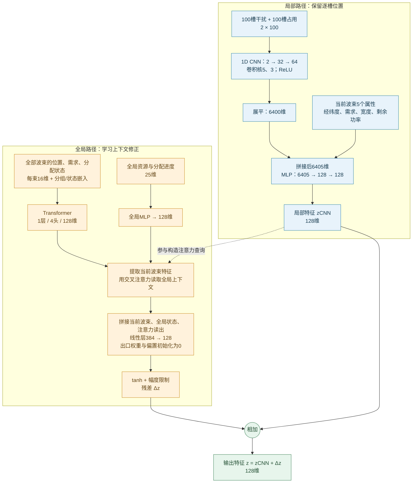
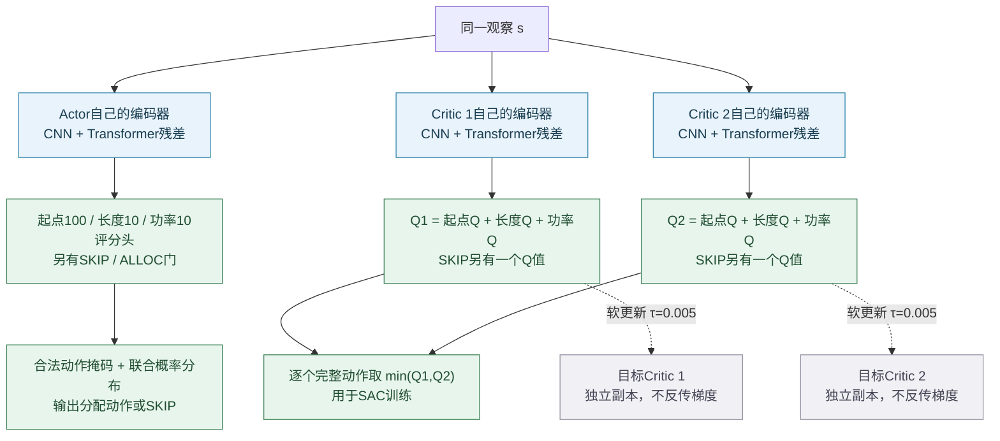

# Spectrum T-SAC 当前网络结构图

对应当前代码 `PPO4090/implementations/spectrum_tsac_20260921/models/networks.py` 与冻结修复配置。这里只说明结构；训练跟进仍按用户要求暂停。

## 1. 单个编码器的结构

CNN保留逐槽信息；Transformer读取整个波束集合，再给CNN特征增加有界修正。下图是编码器模板，Actor、两个Critic各自有一份，参数不共享。

查询由 `zCNN`、当前波束Token和全局MLP向量拼接后投影生成；Key/Value来自Transformer的全部有效波束Token。padding通过掩码排除。

残差的实际计算为：

\[
\Delta z=0.25\,\max\bigl(\operatorname{RMS}(\operatorname{stopgrad}(z_{CNN})),1\bigr)\,\tanh(W_o[c,g,h]+b_o),\qquad z=z_{CNN}+\Delta z.
\]

这里 `c` 是当前波束特征，`g` 是全局状态向量，`h` 是交叉注意力读出。`W_o,b_o` **仅在初始化时为0，训练中可更新**；残差相加后没有额外LayerNorm。因此迁移同一个CNN父模型时，初始化输出与父CNN精确一致，之后才逐渐学习上下文修正。

## 2. Actor、双Critic与目标网络

- **不是共享一个编码器**：Actor、Q1、Q2各自独立；加上两个目标Critic，总共5份编码器，没有目标Actor。
- Actor的三个头独立生成评分，但**不独立采样三个动作分量**：评分相加后，对合法ALLOC组合统一做softmax，再与SKIP/ALLOC门组合。默认最多9550个ALLOC加1个SKIP，实际可用数量由掩码决定。
- 两个Critic分别计算完整动作Q，再取较小者；不对三个Q分支分别取min后相加。
- 纯CNN对照使用同一个CNN父检查点，省去全局残差分支；其余冻结设置相同。残差是否带来实际收益，仍需同预算配对验证。

源码：[网络结构](D:/graduate/PPO4090/implementations/spectrum_tsac_20260921/models/networks.py)、[SAC更新](D:/graduate/PPO4090/implementations/spectrum_tsac_20260921/rl/sac.py)、[冻结继续训练计划](D:/graduate/第二阶段T-SAC实施记录/Spectrum修复继续训练计划.json)。
