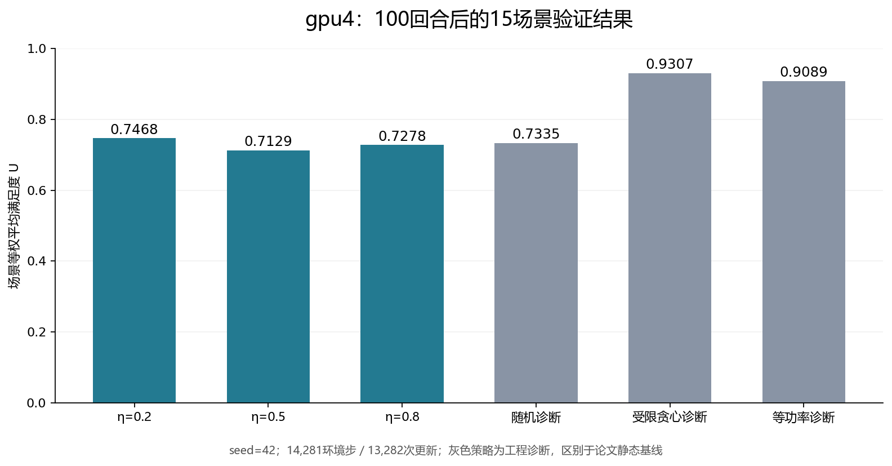

# gpu4夜间超参数最终验证报告

报告时间：2026-09-21。原η批次于北京时间04:16完成训练、最终验证及远端持久化；本报告依据04:39跟进取回的真实结果。

**三组均完成相同预算，但未验证出相对现有诊断策略的算法优势。** η=.2在本次15场景validation中均值最高；三组对随机诊断的配对场景bootstrap 95%区间均跨0。所有结果来自seed42，不能写成多seed显著优势。

## 共同预算与结果

三组均100个完整回合、14281环境步、13282次优化更新；独立评价使用相同15个validation场景和不可变最终检查点。物理、数据、网络、批量、学习率与采样协议冻结，仅目标熵比例η不同。该批次未访问测试集，全部评价策略的约束违约总数均为0。

- **η=0.2：平均U=0.746843**，按需求实体加权U=0.743239；相对随机平均差=+0.013351，95%场景区间[-0.012345, 0.038579]。平均SGM=0.678772，交付吞吐=48.725 Gbps，平均用功=5750.7 W，平均SKIP比例=6.92%。
- **η=0.5：平均U=0.712888**，按需求实体加权U=0.709525；相对随机平均差=-0.020604，95%场景区间[-0.049500, 0.005431]。平均SGM=0.660602，交付吞吐=48.303 Gbps，平均用功=5733.7 W，平均SKIP比例=5.11%。
- **η=0.8：平均U=0.727785**，按需求实体加权U=0.726087；相对随机平均差=-0.005708，95%场景区间[-0.029212, 0.013554]。平均SGM=0.624462，交付吞吐=41.678 Gbps，平均用功=5685.0 W，平均SKIP比例=3.49%。

作为同场景工程诊断，随机U=0.733493、受限贪心U=0.930745、等功率贪心U=0.908905。η=.2仍分别低于后两者0.183902和0.162061。这里的贪心是在含SKIP的合法候选ID中等间距抽至多16项，逐步选择即时全局U最大者；等功率诊断限定25 W后再作即时选优。二者均不同于论文的Greedy/Fixed定义，也不是理论上界，不能混入论文七基线表冒名替代。该随机诊断包含主动SKIP，也不同于论文Random仅均匀抽取合法ALLOC、无可分配动作时才SKIP的规则。

以上区间使用2000次配对场景bootstrap、重采样seed0，独立审查重算与原件一致。它只反映这15个配对场景的抽样差异，不包含训练种子方差；现有CSV缺root/assignment证明，场景来源的严格独立性未验收。η=.2只是此次validation的描述性领先；先前25回合3场景中η=.8领先的结果不能代替此次更大验证集。论文基线主参考仍按冻结协议保留η=.5，η=.2仅作为由validation选择的补充参考，不在运行中偷偷换参。

## 可追溯记录

- 熵目标0.2：run_id `20260920T175318_d20568cffeaa`，最终checkpoint `6ed7277268604a6fa29fd62b6466f35a`，evaluation `ab18caf0280b`。
- 熵目标0.5：run_id `20260920T175318_b8b9d93a0d79`，最终checkpoint `9f5e288408cb478994c9f549db7d90ef`，evaluation `638aaff870fa`。
- 熵目标0.8：run_id `20260920T175318_d20baa2bfb80`，最终checkpoint `b12228f000b64f13aa3939c162e70997`，evaluation `51789a185ab4`。

共同场景：`cover_output_0, cover_output_29, cover_output_31, cover_output_33, cover_output_34, cover_output_35, cover_output_54, cover_output_56, cover_output_6, cover_output_62, cover_output_76, cover_output_79, cover_output_81, cover_output_87, cover_output_99`。

已取回628份结果/清单/计划/预检/评价及日志原件，逐文件SHA256与远端字节一致，约14.32 MB。完整模型权重、SQLite及全部运行工件仍保留在远端home的原部署输出目录；本次没有下载正在写入的SQLite，也没有宣称全部大体积权重已回传。

- [原始最终比较JSON](./远程结果原件20260921-0439/原η实验/夜间最终比较.json)
- [取回文件与SHA清单](./远程结果取回清单20260921-0439.json)
- [远程恢复状态](./远程长训练状态.json)

原评价器保留通用标签`short_validation_only`，不影响本次实际15个validation场景的完整计数；它仍明确`formal_multiseed_complete=false`。本轮未修改运行源码来重命名标签。

## 论文基线后续

基线进度快照时间UTC `2026-09-20T20:41:41.286909+00:00`。父实验成功后五组真实GPU预检已全部通过：每组1回合、139环境步，MLP/CNN-SAC、DQN与局部T-SAC各1次更新，PPO为3次minibatch更新。预检被标为`paper_baseline_preflight`，不计入正式研究样本，也不等于在GPU重跑了本地全部221个测试。

- MLP-SAC：running，完成回合=63，环境步=9076。
- CNN-SAC：running，完成回合=61，环境步=8847。
- MLP-DQN：trained，完成回合=100，环境步=14281；15场景validation平均U=0.720496、约束违约0。
- MLP-PPO：running，完成回合=71，环境步=10217。
- T-SAC局部观察控制组：queued，完成回合=待启动，环境步=待启动。

这些是运行阶段记录，尚无七基线完整共同预算结果。完成后按冻结计划比较同环境交互预算，先冻结选择再执行全15场景test，不用test调参。本自动跟进继续保持，每30分钟检查，待原η实验、七基线及文档/结果同步全部完成才暂停。

[论文基线GPU短验原件](./远程结果原件20260921-0439/论文基线队列/GPU短验结果.json) · [基线恢复状态](./论文基线后续状态.json) · [本地验收与代码审查](./论文基线本地验收与代码审查报告.md)
