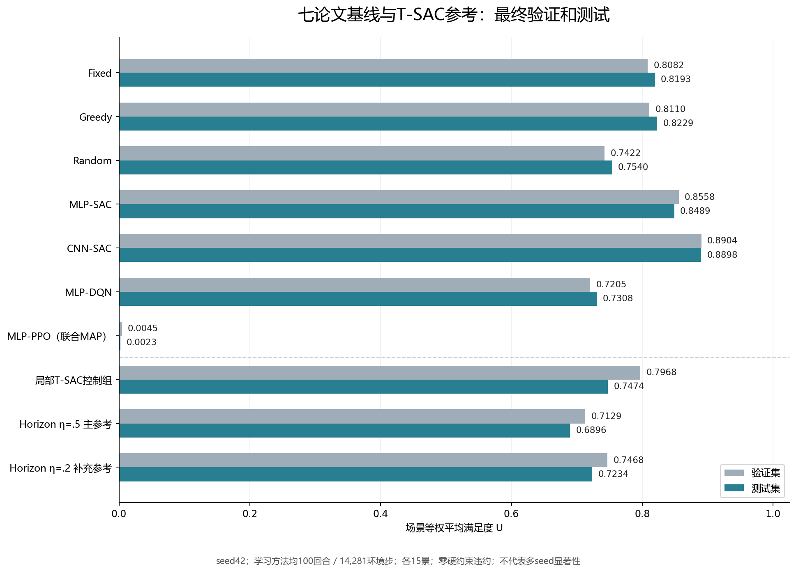

# 论文七基线最终对比与夜间训练验收报告

日期：2026-09-21。**本轮授权的夜间η探索、论文七基线方法适配、局部观察控制组以及冻结后的验证/测试评价均已完成。工程执行与结果归档闭环；正式多seed研究、严格广覆盖数据和日志性能目标仍有未完成项。**

CNN-SAC在本次15个测试场景上的平均满足度最高，为0.889815。Horizon主参考η=.5为0.689636，validation选定的补充参考η=.2为0.723357，本轮未体现Horizon优势。PPO联合MAP确定性评价为0.002260，原值保留，并附实际权重诊断。不能以工程验收通过替代性能结论，也不能据本次单seed适配宣称原论文结论已经复现。

## 方法与最终数值

以下顺序按方法类别排列。每行依次为validation平均U、test平均U；全部10个方法各15景，两阶段合计300次场景评价，硬约束违约均为0。

- **Fixed**：0.808167 / **0.819313**。
- **Greedy**：0.810991 / **0.822886**。
- **Random**：0.742225 / **0.754036**。
- **MLP-SAC**：0.855829 / **0.848889**。
- **CNN-SAC**：0.890374 / **0.889815**。
- **MLP-DQN**：0.720496 / **0.730785**。
- **MLP-PPO（联合MAP）**：0.004466 / **0.002260**。
- **局部T-SAC控制组**：0.796831 / **0.747366**。
- **Horizon η=.5 主参考**：0.712888 / **0.689636**。
- **Horizon η=.2 补充参考**：0.746843 / **0.723357**。

前七项是论文第IV节方法。后三项分别是同局部205信息的T-SAC控制、预先指定的Horizon主参考、由validation选出的Horizon补充参考。数字允许描述性比较；`ranking_available=false`保留为正式统计排名尚不成立，不能改成多seed优势。

CNN-SAC测试SGM为0.694885，平均交付吞吐约59.995 Gbps、平均用功5435.7 W、SKIP约0.966%。Horizon主参考的平均U低于CNN-SAC约0.200179；局部T-SAC测试U=0.747366，也未超过MLP/CNN-SAC。完整观察与局部观察、Actor/Critic结构及模型容量存在差异，不能把这些系统级分差全部归因于某一个编码器。完整SGM、吞吐、用功、SKIP、SINR及计时数据见结果摘要JSON。

## 预算、划分与测试前冻结

所有学习方法/参考的检查点均100个完整回合、14281环境步、seed42；PPO2950次真实minibatch更新，其余13282次，优化器预算不强行视为相等。Fixed、Greedy、Random不需要训练，其记录不会伪装成神经模型训练产物。

各方法使用相同冻结输入清单、物理、动作和6000W预算；同一phase的15个场景ID/需求一致。validation与test场景ID无交集。现有CSV的原始root/assignment仍缺失，不能由文件划分一致进一步宣称严格来源独立。

测试前选择清单在UTC 2026-09-20T21:32:12.961643+00:00（北京时间05:32）写出：主参考η=.5预先固定，补充η=.2仅由父批次相同预算的全15景validation均值选择；`test_set_consulted=false`。此后才按冻结选择执行test，未用test指标调整参数、检查点或解码。训练、评价和归档已结束，gpu4进程核查未见本批Python任务继续运行。

论文静态策略按已记录的未刊细节适配：Fixed采用长度5/30W及顺序可用位置；Greedy按占用选频并以场景正需求分位选择20/25/30W；Random均匀抽合法ALLOC，无合法分配才SKIP。它们与早期Horizon诊断中的“16候选即时U搜索贪心”“25W即时U搜索”“可主动SKIP随机”不同，最终报告使用的是真实论文适配入口。

## PPO结果解释与代码审查结论

PPO测试U=0.002260、平均SKIP=99.4893%，13/15景U=0。此前validation U=0.004466、12/15景全SKIP，训练末25回合采样平均U约0.721760。训练采样与冻结联合MAP评价不是同一决策方式。

实权重只读诊断在一个原validation首状态证实：ALLOC总概率约99.45%，但SKIP概率0.005482高于最大单ALLOC概率0.002216，所以联合argmax选择SKIP。该证据直接证明这一状态的概率分散效应，不能解释所有低分，也不能据此宣称采样策略已经在独立测试中有效。未发现本次低分对应的可复现协议实现错误，因此没有擅自改解码、改参或重跑覆盖结果。任何替代解码研究须另立具名实验，保留本轮冻结主结果。

- [PPO实际权重独立诊断](./PPO确定性解码独立诊断.md)
- [第二阶段代码审查报告](./第二阶段重构代码审查报告.md)
- [论文基线本地验收与代码审查](./论文基线本地验收与代码审查报告.md)

本地既有完整测试219通过、2个CUDA专用用例跳过；五个学习方法的独立GPU短验均成功，不能将短验冒称GPU重跑全部测试。PPO针对低分另复核21项通过、1项CUDA跳过，有重叠，不累加。历史126个文件的保留证据仍有效，本轮跟进未修改训练源码、冻结参数或旧产物。

## 交付与验收边界

本轮完成：三组η各100回合；五组学习方法各100回合；七论文基线与三个控制/参考的完整validation/test；最终不可变工件和关闭数据库持久归档；中文验收、代码审查及真实结果回传。本地1196份最终原件合计23,813,945字节，逐文件SHA与远端一致。其中全部300个NPZ分配输出共4500个数组均可在allow_pickle=False下读取，没有object数组，可用于既有第三阶段交接接口；此项是产物可读性核验，未冒称再次重算了全部物理。

完整模型权重、SQLite和逐步日志保存在远端home部署的持久副本。最终选定的7个学习检查点共1,081,912,716字节，另在远端重新读取并计算SHA，全部匹配冻结清单。本地回传范围和逐文件SHA在校验清单中明确列出，不宣称全部大体积权重与数据库均已下载。

仍未通过或未开展：严格广覆盖生产数据/root来源验收、此前5%日志开销目标、正式多seed显著性研究；100回合有限预算也不等于论文4000回合原图复刻。论文方法未公开的结构/静态规则已经具名记录，结果限于本次统一修复环境。共享SAC类直接load的配置兼容检查弱于外层artifacts，正式入口继续依赖外层严格验证；该API误用限制仍保留。

- [最终结果摘要](./论文七基线最终结果摘要.json)
- [最终原始比较结果](./最终结果原件20260921-0601/论文七基线完整比较/论文基线对比结果.json)
- [测试前选择清单](./最终结果原件20260921-0601/论文七基线完整比较/测试前选择清单.json)
- [回传文件与SHA清单](./最终结果回传校验清单.json)
- [持久检查点复核](./最终持久检查点复核.json)
- [分配产物可读性核验](./最终分配产物可读性核验.json)
- [最终比较独立验收核查](./最终比较独立验收核查.md)
- [第二阶段验收报告](./第二阶段重构验收报告.md)

所有最终文件同步并核验后，暂停本任务的自动跟进，保留当前任务、远端结果和恢复索引。未取消其他SLURM作业，未删除历史或节点产物。
