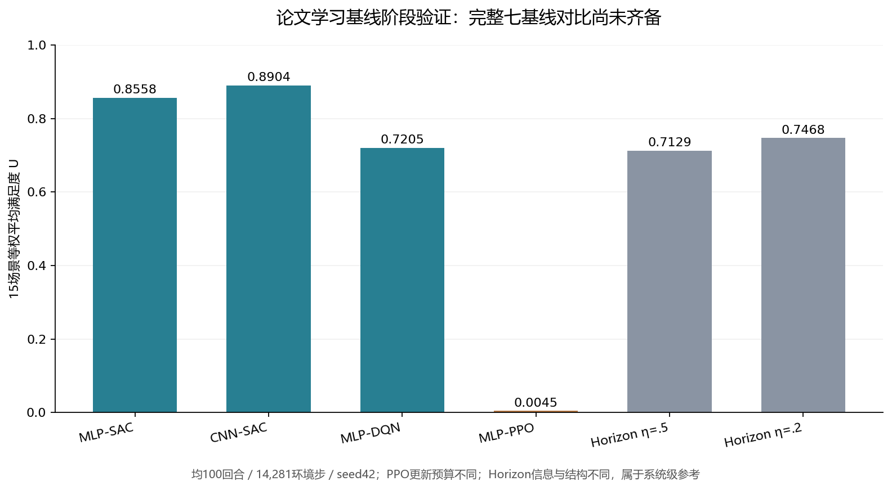

# 论文学习基线阶段验证报告

数据截点：2026-09-21 05:19，北京时间。四个论文学习基线已完成训练、全15场景validation和持久化；局部观察T-SAC控制组仍在训练，完整七基线比较与测试集评价尚未完成。

本报告保留全部原值。CNN-SAC、MLP-SAC在这次验证集上的平均满足度高于两个Horizon参考，PPO确定性评价接近全SKIP；这些是固定seed42与有限训练预算的阶段结果，不能写成算法普遍优劣或CNN编码器独立优于Transformer。

## 相同环境交互预算下的结果

- **MLP-SAC：U=0.855829**；SGM=0.636415，平均交付吞吐=53.604 Gbps，平均用功=5538.3 W，SKIP比例=1.44%；优化更新=13282，硬约束违约=0。
- **CNN-SAC：U=0.890374**；SGM=0.682007，平均交付吞吐=57.358 Gbps，平均用功=5073.3 W，SKIP比例=0.84%；优化更新=13282，硬约束违约=0。
- **MLP-DQN：U=0.720496**；SGM=0.474046，平均交付吞吐=37.179 Gbps，平均用功=3527.7 W，SKIP比例=0.04%；优化更新=13282，硬约束违约=0。
- **MLP-PPO：U=0.004466**；SGM=0.002650，平均交付吞吐=0.410 Gbps，平均用功=18.3 W，SKIP比例=99.18%；优化更新=2950，硬约束违约=0。

四组均100回合、14281环境步，逐项核验为相同15个validation场景、需求及6000W预算。MLP/CNN-SAC和DQN各13282次更新，PPO为2950个真实minibatch更新；对齐的是环境交互预算，不能称优化器计算量相等。

补充检查四个真实运行清单与Horizon η=.5：内嵌data_manifest完整对象、动作规格和physics配置逐项相同；数据清单hash为`154326a45c9dbde33ae6b0613283a1367c09267ff3dde4bb73b19d6752bfb1a5`，数据划分文件SHA256均为`62574aa50d4df0926f0dca642daa2f42643f4cbde82a7af47a44e0b3ced3b8c2`。这证明冻结输入清单/划分的一致性，不补足缺失的root/assignment来源独立性。

四基线采用局部205维观察，Horizon采用完整观察，Actor/Critic结构也可能不同。Horizon主参考η=.5的U=.712888，预先约定由validation选择的补充参考η=.2为.746843；两者作为系统级参考。相同信息的T-SAC控制组尚未完成，不能把当前分差全部归因于编码器。

## PPO低分的证据与诊断边界

PPO的15个validation场景中12景U=0且全部SKIP，场景等权SKIP比例为99.1785%，平均仅使用18.33W。仅3景有SINR样本；其余SINR为null，不能补零后平均。该结果来自真实成功完成的独立评价，不是缺日志或未训练。

同时，PPO最终训练回合U约0.701442、135束中只SKIP1束；最后25个训练回合平均U约0.721760、平均SKIP比例约0.676%。实际最终检查点的CPU只读诊断发现：在原validation场景`cover_output_0`的首状态，9550个合法ALLOC的总概率为0.994518079，单个SKIP概率为0.005481800；但最大单ALLOC概率只有0.002215700，故全联合argmax仍选择SKIP。

这直接证实至少该状态存在联合最大概率解码效应：分配动作总概率很高，却分散在大量具体动作上，单个SKIP成为最可能的具体动作。不能把确定性评价的近全SKIP解释成Actor将多数概率给SKIP，更不能直接推断采样策略或PPO算法整体无效。这一证据并未证明所有低分都由同一机制解释；本批PPO评价对象仍是已冻结的联合argmax策略，U=0.004465657保持不变。[独立诊断](./PPO确定性解码独立诊断.md)记录实际权重哈希、原始概率和复核结果。没有更改冻结评价协议、参数或原结果，也未追加测试集选参。

## 可追溯记录

- MLP-SAC：run `20260920T201733_b5d92d21adf3`，checkpoint `02ee3bbc94b74de8a39df3e98ddfbb56`，evaluation `41851d93d020`。
- CNN-SAC：run `20260920T201733_2c40a6bf449e`，checkpoint `5180a86491a046a98b39f0004e1e4210`，evaluation `7a3997c16cf1`。
- MLP-DQN：run `20260920T201733_b691167ad121`，checkpoint `4d352c48e4624e6e83f5f2549727b3e8`，evaluation `f7045be59f8f`。
- MLP-PPO：run `20260920T203641_73d4515809fe`，checkpoint `960331c1325a4d8b83fedf46fbc3a610`，evaluation `e0f2c4d68ba4`。

本轮取回224份评价、训练结果、运行清单、检查点清单和监督记录，共4,997,914字节，逐文件SHA与远端原件一致；PPO最终检查点另已取回并核验SHA用于只读诊断。完整运行权重、SQLite与历史工件保留在远端home，未拷贝活跃数据库。

- [阶段比较数据](./论文学习基线阶段比较数据.json)
- [原件取回与SHA清单](./远程结果取回清单20260921-0519.json)
- [远程状态快照](./远程跟进快照20260921-0519.json)
- [原η最终验证报告](./gpu4夜间超参数最终验证报告.md)

当前不发布完整七基线排名；论文Fixed/Greedy/Random统一评价将由现有队列在学习任务收尾后执行，不拿先前Horizon的诊断策略冒名替代。按冻结计划先完成共同预算选择，再执行全15景test，不使用测试集调参。此批仍是统一修复环境的方法适配，非原论文图表数值复刻；原训练与后续队列均未因本轮跟进而改参或重复启动。
